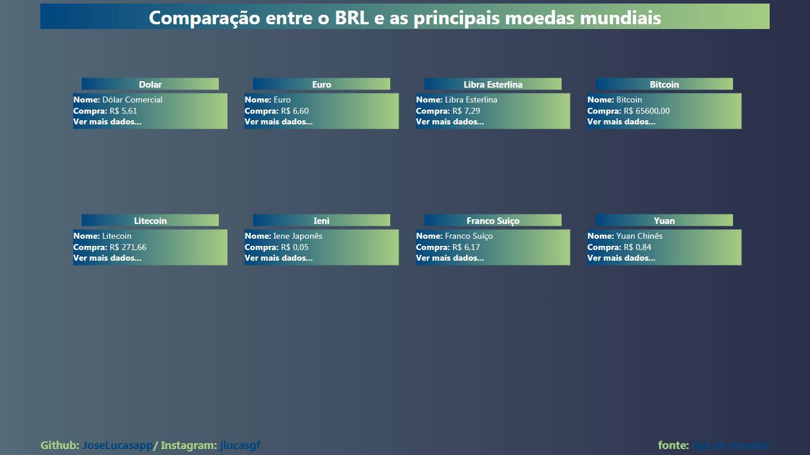
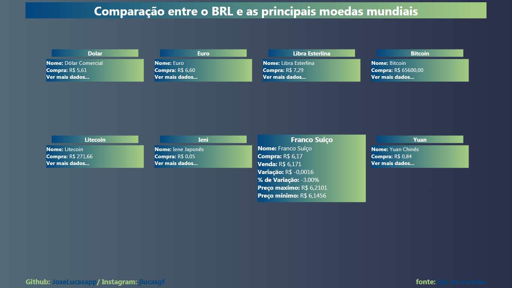

<h1 align='center'>Comparison between the BRL value and other currencies</h1>

<b>Tool Links</b>

  

  
  

  
  # Sumário
  
   - [Used Tools](#used-tools)
   - [what is it ?](#what-is-it)
   - [Where to find ?](#where-to-find)
   - [What information is available ?](#what-information-is-available)
   - [More Informations](#more-informations)
   - [Author](#author)
   
  # Used Tools
  
  <table>
  <tr>
    <td><b>Javascript</b></td>
    <td>ReactJS</td>
  </tr>
  </table>
  
  # what is it ?
  
It is a system that shows the price of the Brazilian Real in comparison to the major currencies (Ex .: Dolar, Euro and etc.) on the market using an API

  
  # Where to find?
  
The system can be found <a href='https://brl-currency-converter.vercel.app/'>clicking here</a>.
  
  # What information is available ?
  <ol>
    <li>Name</li>
    <li>Purchase price</li>
    <li>Sale value</li>
    <li>Percentage of variation</li>
    <li>Variation value</li>
    <li>Maximum price</li>
    <li>Minimum price</li>
  </ol>
  
  # More Informations
  
The system currently looks like this: 

  
  
  
  
When hovering the mouse (if using a computer or notebook), or clicking (if using a mobile device) more information about that comparison between currencies will be displayed. In the image <b> Swiss Franc </b> was clicked

  
  
  
  # Author
  <a href='https://www.instagram.com/jlucasgf/?hl=pt-br'>José Lucas</a>
  

